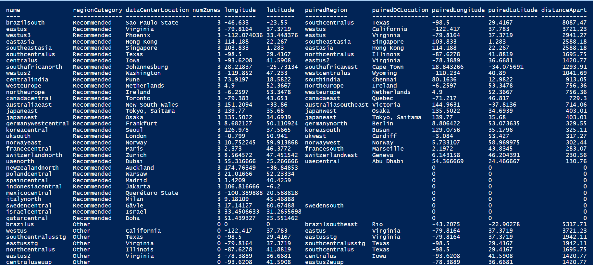
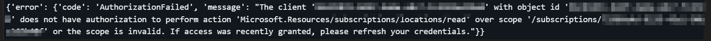
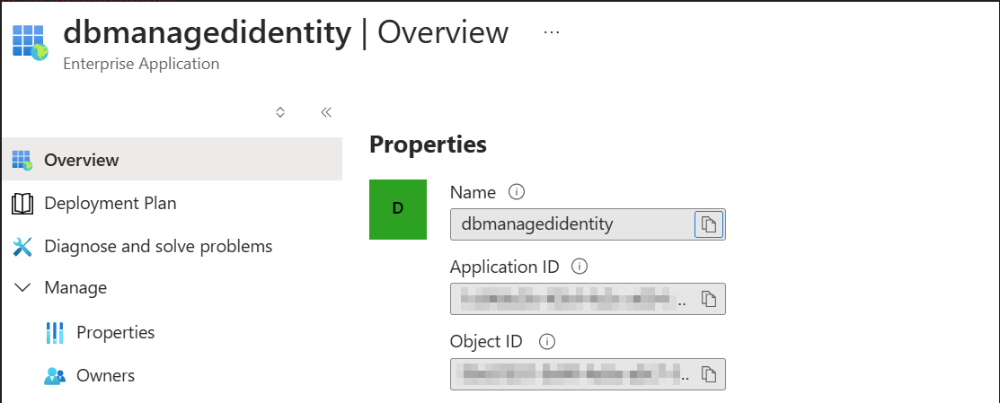
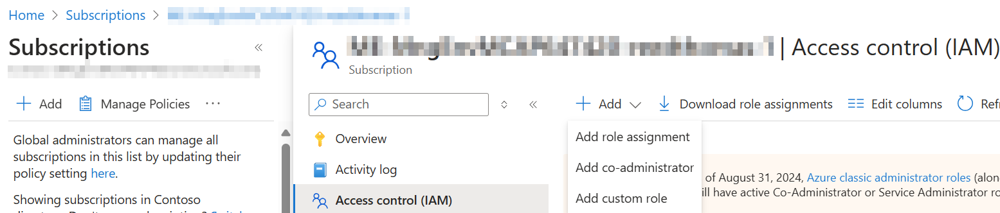
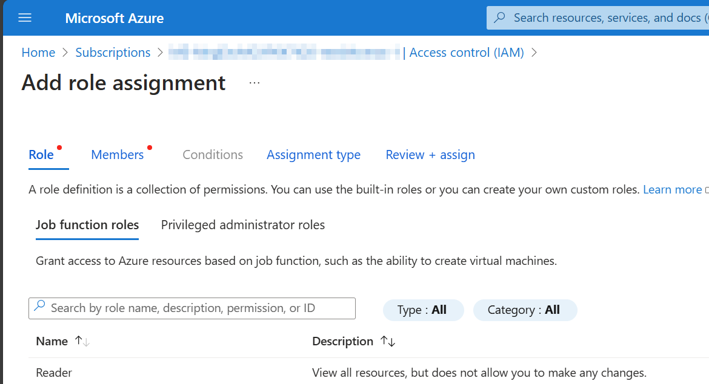
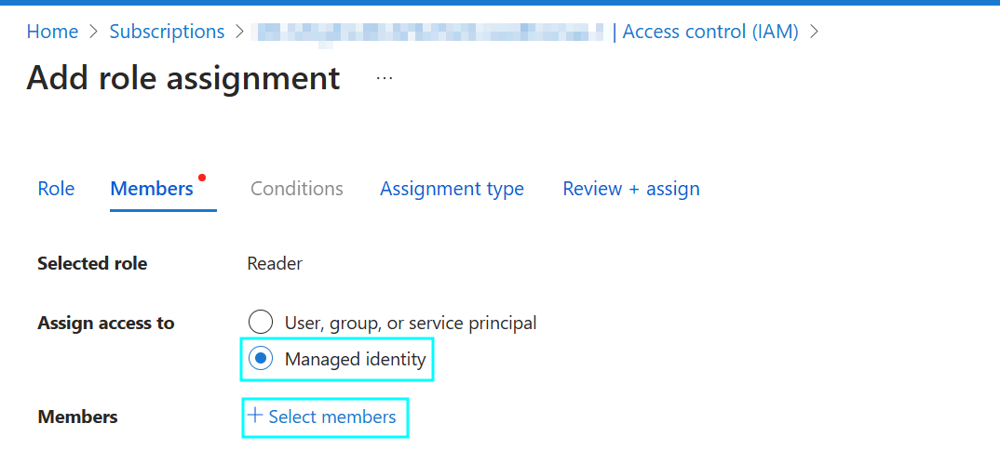
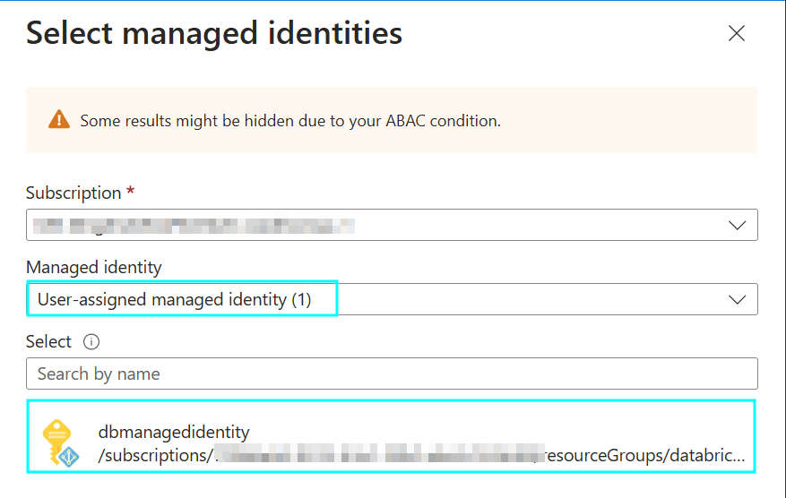
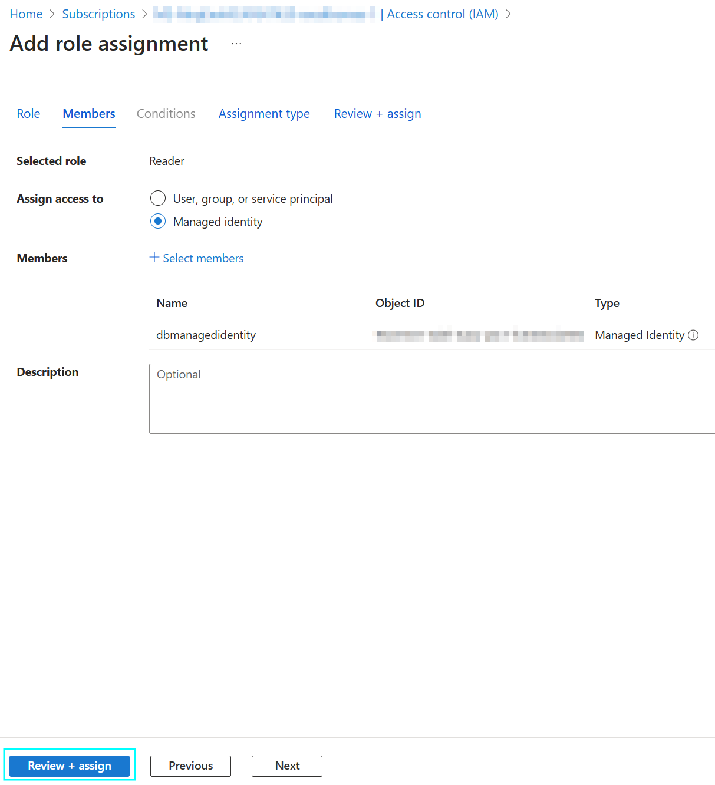
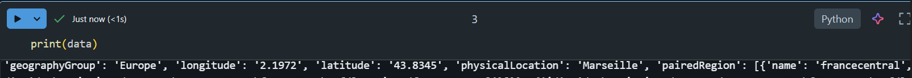

# Distance-Between-Azure-Regions
How to check the distance between paired primary and secondary Azure regions

## List-Locations API
Using the [List-Locations API](https://learn.microsoft.com/en-us/rest/api/resources/subscriptions/list-locations?view=rest-resources-2022-12-01&tabs=HTTP) we can get a list of all Azure regions, their availability zones, latitude and longitude and the paired secondary region

## Havesine Formula
We can then plug latitude and longitude of the primary and secondary regions into the [Haversine Formula](https://en.wikipedia.org/wiki/Haversine_formula) to compute the distance in kilometers.

The Haversine formula is used to calculate the great-circle distance between two points on the Earth's surface, given their latitude and longitude. This formula is particularly useful for navigation and geospatial applications.

Components of the Formula:

### 1. Latitude and Longitude in Radians

First, we need to convert the latitude and longitude of both points from degrees to radians by multiplying by $$\frac{\pi}{180}$$. This is because trigonometric functions in the formula (like sine and cosine) require input in radians.

### 2. Differences in Latitude and Longitude

Next, we calculate the differences between the latitudes and longitudes of the two points:

$$
\Delta \text{lat} = \text{lat}_2 - \text{lat}_1
$$

$$
\Delta \text{long} = \text{long}_2 - \text{long}_1
$$


The Haversine formula itself consists of two main parts:

#### a. Calculation of 'a'. This part calculates the square of half the chord length between the points.

$$
a = \sin^2\left(\frac{\Delta \text{lat}}{2}\right) + \cos(\text{lat}_1) \cdot \cos(\text{lat}_2) \cdot \sin^2\left(\frac{\Delta \text{long}}{2}\right)
$$


#### b. Calculation of 'c'. This part calculates the angular distance in radians.

$$
c = 2 \cdot \text{atan2}\left(\sqrt{a}, \sqrt{1-a}\right)
$$


### 3. Distance Calculation

Finally, we calculate the distance \( d \) between the two points:

$$
d = R \cdot c
$$

Where:
- R is the Earth's radius (mean radius = 6,371 km).
- d is the distance between the two points in kilometers.

## PowerShell
[Code](./PowerShell/DistanceBetweenAzureRegions.ps1)


## Databricks PySpark Notebook
Databricks has passthrough authentication so you'd be forgiven for thinking that your user credentials would get passed through to the REST API the same way that it does to a data lake. However, if you run the code below, you'll get an authorization error.

``` python
from azure.identity import *
import requests
subscriptionId = "XXXX-XXXX-XXXX-XXXX-XXXX"
url = f"https://management.azure.com/subscriptions/{subscriptionId}/locations?api-version=2022-12-01"
credential = DefaultAzureCredential()
# Set the authorization header
headers = {
    "Authorization": f"Bearer {credential.get_token('https://management.azure.com/.default').token}",
    "Content-Type": "application/json"
}
response = requests.get(url, headers = headers)
data = response.json()
```


Unfortunately, passthrough authentication only works for storage accounts, not REST APIs and databases.  If you go into Entra Id and look up the client id, you will see that the user assigned managed identity "dbmanagedidentity" that is associated with your workspace is being used instead.  


As mentioned in the error message, dbmanagedidentity is missing the Reader RBAC role for the subscription:
1. Open the access control blade for your subscription


2. Select the Reader role 


3. Select managed identities and find dbmanagedidentity for your workspace under user assigned managed identities



4. Review + Assign


Now when we run the code again it executes successfully!

