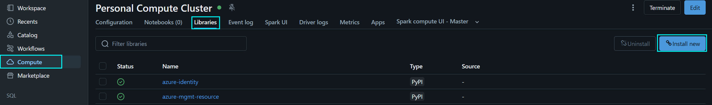
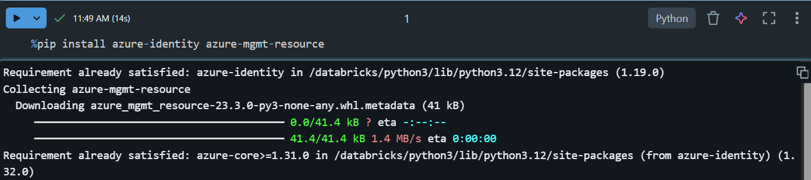
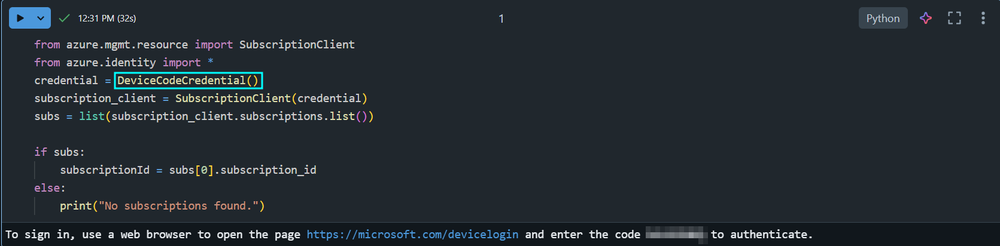
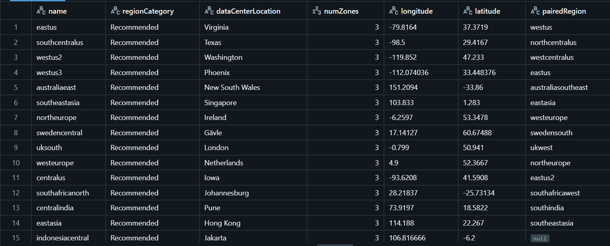
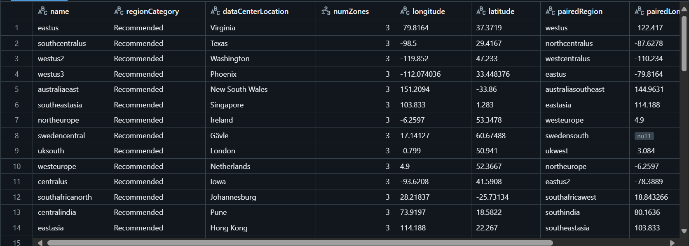
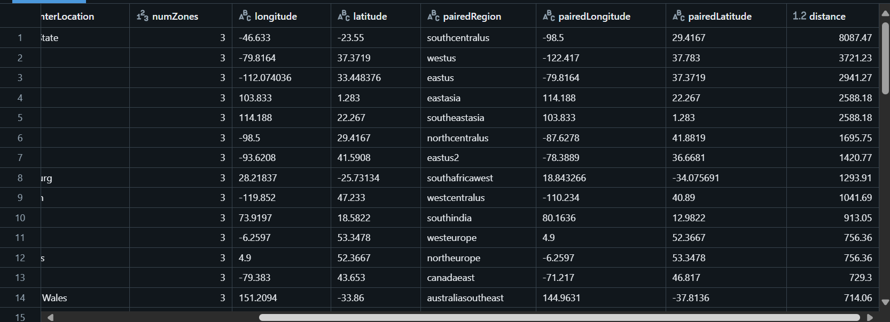

# Distance-Between-Azure-Regions
How to check the distance between paired primary and secondary Azure regions

## List-Locations API
Using the [List-Locations API](https://learn.microsoft.com/en-us/rest/api/resources/subscriptions/list-locations?view=rest-resources-2022-12-01&tabs=HTTP) we can get a list of all Azure regions, their availability zones, latitude and longitude and the paired secondary region

## Havesine Formula
We can then plug latitude and longitude of the primary and secondary regions into the [Haversine Formula](https://en.wikipedia.org/wiki/Haversine_formula) to compute the distance in kilometers.

The Haversine formula is used to calculate the great-circle distance between two points on the Earth's surface, given their latitude and longitude. This formula is particularly useful for navigation and geospatial applications.

Components of the Formula:

### 1. Latitude and Longitude in Radians

First, we need to convert the latitude and longitude of both points from degrees to radians by multiplying by $$\frac{\pi}{180}$$. This is because trigonometric functions in the formula (like sine and cosine) require input in radians.

### 2. Differences in Latitude and Longitude

Next, we calculate the differences between the latitudes and longitudes of the two points:

$$
\Delta \text{lat} = \text{lat}_2 - \text{lat}_1
$$

$$
\Delta \text{long} = \text{long}_2 - \text{long}_1
$$


The Haversine formula itself consists of two main parts:

#### a. Calculation of 'a'. This part calculates the square of half the chord length between the points.

$$
a = \sin^2\left(\frac{\Delta \text{lat}}{2}\right) + \cos(\text{lat}_1) \cdot \cos(\text{lat}_2) \cdot \sin^2\left(\frac{\Delta \text{long}}{2}\right)
$$


#### b. Calculation of 'c'. This part calculates the angular distance in radians.

$$
c = 2 \cdot \text{atan2}\left(\sqrt{a}, \sqrt{1-a}\right)
$$


### 3. Distance Calculation

Finally, we calculate the distance \( d \) between the two points:

$$
d = R \cdot c
$$

Where:
- R is the Earth's radius (mean radius = 6,371 km).
- d is the distance between the two points in kilometers.

## PowerShell


### Code
You can find the code [here](./PowerShell/DistanceBetweenAzureRegions.ps1)

## Databricks PySpark Notebook
### Required libraries:
- azure-identity
- azure-mgmt-resource

You can either install these on your cluster (recommended unless it's a one-off exercise):


Or run ```%pip install azure-identity azure-mgmt-resource``` in a cell in your notebook:


Note: The solution below assumes that your workpace is enabled for Unity Catalog

### Solution
Databricks used to support something called [passthrough authentication](https://learn.microsoft.com/en-us/azure/databricks/archive/credential-passthrough/adls-passthrough#enable-azure-data-lake-storage-credential-passthrough-for-a-high-concurrency-cluster) where your user credentials would get passed through to the data lake and you'd have access to the data that you're permissioned for there.  (Unity Catalog uses [storage credentials](https://learn.microsoft.com/en-us/azure/databricks/connect/unity-catalog/cloud-storage/storage-credentials) instead, which work a bit differently.)  So you might expect your user credentials would get "passed through" to the REST API the same way that they would for a data lake under passthrough authentication. However, if you run the code below, you'll get an authorization error:

``` python
from azure.identity import *
import requests
subscriptionId = "XXXX-XXXX-XXXX-XXXX-XXXX"
url = f"https://management.azure.com/subscriptions/{subscriptionId}/locations?api-version=2022-12-01"
credential = DefaultAzureCredential()
# Set the authorization header
headers = {
    "Authorization": f"Bearer {credential.get_token('https://management.azure.com/.default').token}",
    "Content-Type": "application/json"
}
response = requests.get(url, headers = headers)
data = response.json()
```


Unfortunately, passthrough authentication only works for storage accounts, not REST APIs and databases.  If you go into Entra Id and look up the client id, you will see that the user assigned managed identity "dbmanagedidentity" that is associated with your workspace is being used instead.  


As mentioned in the error message, dbmanagedidentity is missing the Reader RBAC role for the subscription:
1. Open the access control blade for your subscription


2. Select the Reader role 


3. Select managed identities and find dbmanagedidentity for your workspace under user assigned managed identities


4. Review + Assign


Now when we run the code again it executes successfully!


Alternatively, you can replace the call to ```DefaultAzureCredential()``` with ```DeviceCodeCredential()``` to use your authenticated local user instead:


Let's modify the code to automatically retrieve the subscription id for our workspace

``` python
from azure.mgmt.resource import SubscriptionClient
from azure.identity import *
credential = DefaultAzureCredential()
subscription_client = SubscriptionClient(credential)
subs = list(subscription_client.subscriptions.list())

if subs:
    subscriptionId = subs[0].subscription_id
else:
    print("No subscriptions found.")

import requests
url = f"https://management.azure.com/subscriptions/{subscriptionId}/locations?api-version=2022-12-01"

# Set the authorization header
headers = {
    "Authorization": f"Bearer {credential.get_token('https://management.azure.com/.default').token}",
    "Content-Type": "application/json"
}

response = requests.get(url, headers = headers)
data = response.json()
```

Next we will load the data into a spark dataframe and convert the json to columns
``` python
df = spark.read.json(spark.sparkContext.parallelize([data]))
df_flattened = df.selectExpr("explode(value) as location").select("location.*").where("metadata.regionType == 'Physical'").selectExpr("name", "metadata.regionCategory as regionCategory", "metadata.physicalLocation as dataCenterLocation", "size(availabilityZoneMappings) as numZones","metadata.longitude as longitude", "metadata.latitude as latitude", "metadata.pairedRegion.name[0] as pairedRegion")

display(df_flattened)
```


Now that we have the data in table format we can join it to itself on the paired region column to get longitude and latitude for the paired region
``` python
from pyspark.sql.functions import *
# Create a lookup DataFrame for paired regions
paired_df = df_flattened.selectExpr("name as pairedRegionName", "longitude as pairedLongitude", "latitude as pairedLatitude"
)

# Perform a self join to add the pairedLongitude and pairedLatitude columns
df_with_paired_location = df_flattened.join(
    paired_df,
    df_flattened.pairedRegion == paired_df.pairedRegionName,
    "left"
).drop("pairedRegionName")

# Display the DataFrame
display(df_with_paired_location)
```


Finally, we add the distance calculation
``` python
df_with_distance = df_with_paired_location.withColumn("distance", round(6371 * acos(cos(radians(df_with_paired_location.latitude)) * cos(radians(df_with_paired_location.pairedLatitude)) * cos(radians(df_with_paired_location.longitude) - radians(df_with_paired_location.pairedLongitude)) + sin(radians(df_with_paired_location.latitude)) * sin(radians(df_with_paired_location.pairedLatitude))), 2))

display(df_with_distance.orderBy("regionCategory", "distance", ascending=False))
```


### Code
You can download the complete notebooks here:
Authentication with [workspace user-assigned managed identity](./Databricks/CallRESTApi.ipynb)
Authentication with local user using a [device code](./Databricks/CallRESTAPIDeviceCode.ipynb)
